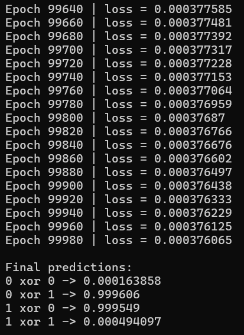

# mini-dl-framework

A minimal deep learning framework implemented from scratch in modern C++.

This project was developed to gain a deep understanding of:
- automatic differentiation (reverse-mode autograd)
- neural network training
- tensor operations and computational graphs
- low-level system design for ML frameworks

---

## Features

- Custom **Tensor** implementation
- Reverse-mode **Autograd Engine**
- Core tesnor ops: `add`, `mul`, `matmul`, `sum`
- Neural network layers:
	- `Linear`
- Activation functions:
	- ReLU, Sigmoid, Tanh, Softmax
- Loss funcions:
	- MSE, Binary Cross Entropy, Cross Entropy
- Optimizer:
	- SGD
- Training pipelines:
	- XOR (sanity check)
	- MNIST (multi-class classification)

---

## Architecture

The framework is designed with a clear separation of concerns:

- **Tensor**
	- stores data, gradients, and graph connections
- **Autograd Engine**
	- builds computation graph
	- performs reverse-mode differentiation
- **Operations**
	- define forward pass and local backward functions
- **Modules**
	- abstraction for neural network layers
- **Optimizer**
	- updates parameters via gradient descent

This mirrors the design principles of modern frameworks like PyTorch, but in a minimal and educational form.

---

## Results

### XOR (Sanity Check)

Simple feedforward network trained to learn XOR:

- `0 xor 0 -> 0.00016`
- `0 xor 1 -> 0.99961`
- `1 xor 0 -> 0.99955`
- `1 xor 1 -> 0.00049`



Successfully learns non-linear boundary

---

### MNIST (Handwritten Digit Classification)

Model:
- Input: 784 (28x28)
- Architecture: 784 -> 128 -> 64 -> 10
- Activation: ReLU
- Output: Softmax
- Loss: Cross Entropy
- Optimizer: SGD


training on 1000 samples:

```
Epoch 0 | loss = 1.67614 | accuracy = 60.3%
Epoch 1 | loss = 0.462179 | accuracy = 84.1%
Epoch 2 | loss = 0.235046 | accuracy = 92.4%
Epoch 3 | loss = 0.114682 | accuracy = 96.1%
Epoch 4 | loss = 0.0428207 | accuracy = 99.1%
```

Sample predictions:
```
Sample 0 | predicated = 5 | actual = 5
Sample 1 | predicated = 0 | actual = 0
Sample 2 | predicated = 4 | actual = 4
Sample 3 | predicated = 1 | actual = 1
Sample 4 | predicated = 9 | actual = 9
```

Demonstrates correct gradient flow and learning capability
Confirms stability of autograd + traing pipeline

---

## Build & Run

### Requirements
- C++17
- CMake ≥ 3.16
- Visual Studio / GCC / Clang

### Build

```
mkdir build
cd build
cmake ..
cmake --build .

```

## Run examples

```
./xor_example
./mnist_mlp

```

---

## Project Structure

```
include/
├── tensor.h
├── autograd.h
├── module.h
├── linear.h
├── activations.h
├── losses.h
├── optimizer.h
├── mnist.h
└── utils.h

src/
├── tensor.cpp
├── autograd.cpp
├── module.cpp
├── linear.cpp
├── activations.cpp
├── losses.cpp
├── optimizer.cpp
├── mnist.cpp
└── utils.cpp

examples/
├── xor.cpp
└── mnist_mlp.cpp

tests/
├── test_activations.cpp
├── test_autograd.cpp
├── test_bce_loss.cpp
├── test_gradient_check.cpp
├── test_linear_training.cpp
├── test_matmul_autograd.cpp
├── test_mnist_loader.cpp
├── test_softmax_cross_entropy.cpp
├── test_tensor.cpp
└── test_utils.cpp

```

---

### Motivation

The goal of this project is not performance, but **understanding**.

By implementing all components manually:
- the full backpropagation pipeline becomes transparent
- tensor operations and gradients are no longer "black boxes"
- architectural trade-offs become explicit

---

### Future Work
- Mini-batch training
- Better optimizers (Adam, RMSProp)
- SIMD / vectorized operations
- GPU acceleration
- Convolutional layers
- Dataset abstractions
